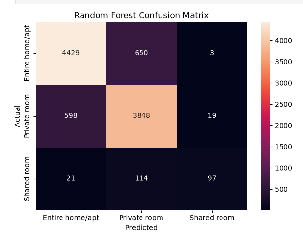

# Airbnb Room Type Predictor

A machine learning classification application that predicts the room type of an Airbnb listing based on listing, location, pricing, review, and availability features.

## Live Demo

https://airbnb-room-type-predictor-classification.onrender.com/

## Problem Statement

Predict whether an Airbnb listing is:

- Entire Home/Apartment
- Private Room
- Shared Room

## Machine Learning

- Python
- Pandas
- NumPy
- Scikit-learn
- Classification

## Model Performance

Four classification models were evaluated on the Airbnb room-type prediction task.

| Model | Accuracy | Macro F1 |
|---|---:|---:|
| Logistic Regression | 66.3% | 0.526 |
| Decision Tree | 78.4% | 0.650 |
| Random Forest | **85.2%** | **0.736** |
| Gradient Boosting | 85.0% | 0.708 |

### Best Model

**Random Forest** achieved the best overall performance with:

- Accuracy: **85.2%**
- F1 Score: **0.736**

### Final Random Forest Evaluation

After model tuning, the Random Forest achieved:

- **Accuracy:** 85.63%
- **Macro Precision:** 84.23%
- **Macro Recall:** 71.71%
- **Macro F1:** **75.83%**

### Per-Class Performance

| Room Type | Precision | Recall | F1 Score | Support |
|---|---:|---:|---:|---:|
| Entire Home/Apt | 0.88 | 0.87 | 0.87 | 5,082 |
| Private Room | 0.83 | 0.86 | 0.85 | 4,465 |
| Shared Room | 0.82 | **0.42** | **0.55** | 232 |

### Confusion Matrix

The confusion matrix shows the model's predictions across the three room-type classes.

The model performs strongly on Entire Home/Apt and Private Room listings, while Shared Room has lower recall due to its relatively small representation in the test set.



## Backend

- FastAPI
- Uvicorn
- REST API

## Deployment

- Render

## Input Features

- Latitude
- Longitude
- Neighbourhood
- Borough
- Price
- Minimum Nights
- Number of Reviews
- Reviews per Month
- Host Listings Count
- Availability

## ML Pipeline

Data → Preprocessing → Model → Prediction → FastAPI → Web Application

## Run Locally

```bash
pip install -r requirement.txt
uvicorn main:app --reload
